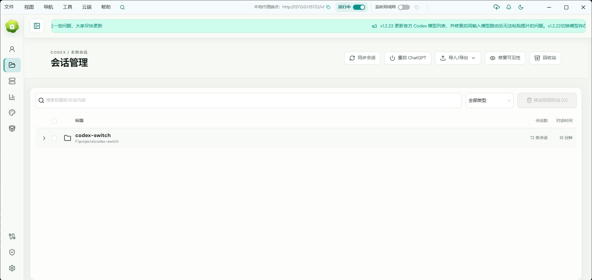
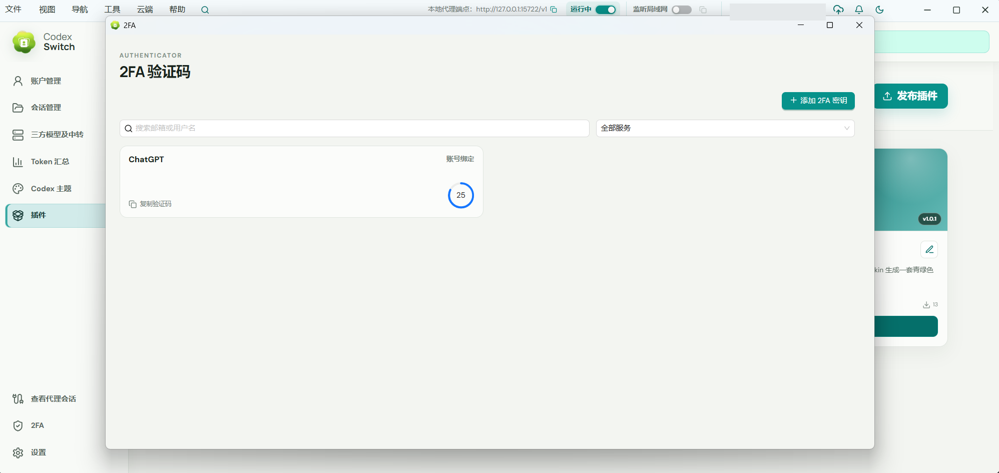

# Codex Switch

> For English documentation, please see [README_EN.md](README_EN.md).

Codex Switch 是一款面向 Codex / ChatGPT 用户的多账号管理工作台，以 Tauri 2 桌面应用为完整管理入口，并支持在本机启动网页版。它集账号登录、用量查看、快捷切换、第三方 Provider、本地热切换代理、Token 分析、Skills 市场和一键换肤于一体，同时支持连接自建后端与移动端，实现跨设备协同管理。

[](LICENSE) [](https://github.com/piperhex/codex-switch/releases)

QQ 技术交流群1：`1051213898`（已满）。

QQ 技术交流群2：`972062132`。

## 产品截图

### 账号管理与本地代理


### 会话管理



### 第三方模型服务商


### Token 消耗分析


### 一键换肤

内置 300+ 套主题预设，并兼容 [Fei-Away/Codex-Dream-Skin](https://github.com/Fei-Away/Codex-Dream-Skin)。


### 插件市场


### 2FA 验证码



### 悬浮用量球

<p align="center">
  
  &nbsp;&nbsp;&nbsp;
  
</p>

## 功能

- 复用 Codex CLI 的 OAuth 2.0 + PKCE 登录流程。
- 支持应用内登录窗口和系统浏览器登录。
- 支持导入和管理多个 `auth.json`，包括常见第三方 JSON 导出及多账号 JSON 文件。
- 原子化切换 `$CODEX_HOME/auth.json`（默认是 `~/.codex/auth.json`）。
- 通过 `.cs` 备份包导出和恢复本地账号与服务商配置。
- 展示账号邮箱、套餐与到期时间、主/次用量窗口、重置卡和当日 Token，并支持自定义账号表格列。
- 支持手动或定时刷新单个账号及全部账号。
- 可从控制台和托盘执行尽力而为的“重启 ChatGPT”操作。
- 提供顶部功能菜单、入口搜索和系统托盘快捷操作。
- 支持可选的置顶悬浮用量球，可切换紧凑圆形或玻璃信息面板样式，并显示用量、重置倒计时和额度状态。
- 支持 OpenAI Responses、兼容 Chat Completions 的第三方 Provider、多模型、模型控制策略和常见中转站余额查询。
- 三方 Provider 统一通过监听 `127.0.0.1:15722` 的本地代理使用，并支持在官方账号与 Provider 间热切换。
- 记录经本地代理转发请求的 Token 用量；支持查看代理会话、消息与上下文占用、响应延迟，并可导出结构化诊断信息。
- 提供按周热力图和趋势图，以及 Token 类型、Provider、模型和账号消耗排行。
- 上游返回 429 时按 1、3、5 秒逐渐增加等待时间并自动重试，默认最多持续 1 分钟；达到时限后按设置自动禁用账号，再向客户端返回最后一次 429。
- 在官方账号模式下，可在额度耗尽后刷新账号、选择主用量窗口使用率最低的可用账号并切换凭据。
- 桌面客户端可在运行界面的同时启动仅监听本机的网页版，也支持 `--headless --port` 无界面运行。
- 内置 Skills 市场，可搜索、安装社区 Skill；登录云端账号后可发布或更新自己的版本化 Skill 包。
- 内置 300+ 套 Dream Skin 主题预设，支持一键应用、自定义背景、外观调整和恢复。
- 设置按外观、窗口、用量、网络、隐私和存储分组，支持界面语言、主题色、关闭到托盘、
  隐私模式、悬浮球、账号刷新和 Token 统计范围等本地选项。
- 可选同步到自建 NestJS 后端；Expo 移动端读取账号摘要与短期 Codex access token，直接向 Codex 刷新用量和重置卡。移动端与独立 Web 端还可远程切换指定 PC 的官方模型或已同步 Provider；跨类型切换后会提示重启 ChatGPT/Codex。
- 账号和服务商密钥仅保存在 Rust 后端，不会暴露给桌面端 React 界面或应用日志。

> [!IMPORTANT]
> 本地账号凭据、服务商 API 密钥和桌面端云登录令牌保存在应用数据目录中，未额外进行静态加密。`.cs` 备份包含有可恢复的账号凭据和服务商密钥，必须像 `auth.json` 一样妥善保护。云同步为可选功能；启用后，账号凭据和服务商密钥会上传到你配置的服务器，移动端还会接收短期 Codex access token 以直连官方接口。请仅在可信手机、可信桌面设备与可信自建服务器上使用，切勿提交或分享凭据文件、备份包，并在共享诊断导出文件前仔细检查内容。

## 技术栈

- 前端：React 18、TypeScript、Vite、Ant Design
- 桌面运行时：Tauri 2
- 后端：Rust、Reqwest、Serde
- 可选云服务：NestJS、TypeORM、PostgreSQL、Redis、JWT 认证
- 移动端：React Native、Expo
- Monorepo：npm workspaces、Lerna、Nx

## 快速开始

### 前置要求

- Node.js 18 或更高版本
- npm
- 最新稳定版 Rust 工具链
- 对应平台的 [Tauri 2 系统依赖](https://v2.tauri.app/start/prerequisites/)
- Windows 上的 WebView2（大多数现代 Windows 已预装）
- macOS 上的 Xcode Command Line Tools

Ubuntu 请先安装 Tauri 的 Linux 构建依赖：

```bash
sudo apt update
sudo apt install libwebkit2gtk-4.1-dev build-essential curl wget file libxdo-dev libssl-dev libappindicator3-dev librsvg2-dev patchelf xdg-utils
```

安装依赖并启动桌面应用：

```powershell
npm install
npm run dev:app
```

使用演示数据启动浏览器预览（不会访问真实凭据）：

```powershell
npm run dev
```

启动管理控制台或云端后端：

```powershell
npm run dev:admin
npm run dev:backend
```

启动 Expo 移动端：

```powershell
npm run start -w @codex-switch/native
```

移动端需要已部署的云端后端，会读取已同步的账号摘要和短期 Codex access token，由手机直接刷新用量与重置卡，同时显示在线 PC，并可分别切换每台 PC 的官方模型或已同步 Provider。远程切换 Provider 前，需要先在目标 PC 启动本地代理；在官方模型与 Provider 间切换后，移动端会提示重启 ChatGPT/Codex。详细配置请参阅 [移动端文档](apps/native/README.md) 和 [管理后端文档](apps/admin/README.md)。

构建桌面安装包：

```powershell
npm run build:app
```

在 macOS 上构建同时支持 Apple Silicon 和 Intel 的通用包：

```bash
npm run build:app:mac
```

在 Windows 上构建 ARM64 安装包：

```powershell
rustup target add aarch64-pc-windows-msvc
npm run build:app:win-arm64
```

Windows ARM64 构建还需要在开发环境中安装带 ARM64 构建工具的 MSVC C++ 工具链。Ubuntu 上运行 `npm run build:app` 会生成 `.deb` 和 AppImage 安装包。

运行全部前后端检查：

```powershell
npm run check
```

## 使用说明

1. 选择“添加账户”，然后在应用内登录、使用系统浏览器登录、导入现有 `auth.json` 或导入兼容 JSON 导出。兼容导入支持单个对象、数组、`{ "accounts": [...] }` 包装对象和逐行 JSON，并识别常见的令牌与会话字段名。
2. 在账号列表刷新用量；展开行可查看重置卡。
3. 选择“切换”，即可原子化替换 Codex 当前使用的 `auth.json`。
4. 若运行中的 ChatGPT/Codex 进程可能仍缓存旧凭据，请在控制台或托盘选择“重启 ChatGPT”。

使用账号工具栏的“导入”和“导出”可恢复或创建包含所有本地账号与服务商配置的 `.cs` 备份。导入会按稳定标识合并记录，并不会将备份当成可随意公开的无密钥导出文件。

“第三方服务商”页面用于管理兼容 OpenAI Responses 或 Chat Completions 的接口、API 密钥、模型列表，以及由 Codex 还是 Codex Switch 控制模型选择。三方 Provider 仅可在本地代理运行时使用；代理会监听 `127.0.0.1:15722` 并使 Codex 指向该地址，从而支持热切换。

### 中转站接入

Codex Switch 支持通过桌面深链从 sub2api、newapi 以及其他兼容页面一键导入中转站 Provider。网页按钮只需要打开下面的自定义协议链接，浏览器会唤起已安装的 Codex Switch，并把参数交给桌面端保存：

```text
cswitch://v1/import?resource=provider&app=codex&name=站点名称&homepage=https%3A%2F%2Fexample.com&endpoint=https%3A%2F%2Fexample.com%2Fv1&apiKey=你的API密钥&balancePlatform=sub2api
```

Codex Switch 只注册自己的 `cswitch://` 协议。所有参数值都必须经过 URL 编码，尤其是 `name`、`homepage`、`endpoint` 和 `apiKey`；API 密钥不要直接拼接未编码的特殊字符。

参数说明：

- `resource=provider`：固定值，表示导入 Provider。
- `app=codex`：按支持 OpenAI Responses 的第三方中转站 Provider 导入，不会识别为官方 OpenAI Provider。
- `app=claude`、`app=gemini` 或 `app=grokbuild`：按兼容 Chat Completions 的自定义 Provider 导入，适合只提供 Chat Completions 的中转站。
- `name`：在 Codex Switch 中显示的 Provider 名称。
- `homepage`：站点主页，保留给兼容页面使用。
- `endpoint`：实际 API Base URL，例如 `https://example.com/v1`。
- `apiKey`：中转站 API 密钥。
- `balancePlatform=sub2api` 或 `balancePlatform=newapi`：可选，用于标记对应的余额查询平台；也接受兼容页面常用的 `platform` 参数名。

页面只需提供余额平台；未提供余额查询地址和 Token 时，Codex Switch 会根据 `endpoint` 补全平台默认地址，并复用导入的 API 密钥。导入时还会自动从中转站加载可用模型；加载失败时使用链接指定的模型或程序默认模型，不会中断导入。

因此，sub2api 使用的核心格式不是账号 JSON，而是上面的 Provider 深链格式：把 `balancePlatform` 设置为 `sub2api`，把 `endpoint` 和 `apiKey` 换成该站点实际值即可。newapi 只需将其改为 `newapi`。深链会在桌面端后台解析并保存，不会把密钥写入前端日志。

官方账号模式下，“自动切号”会在收到额度响应后刷新已保存账号，并选择主用量窗口使用率最低的符合条件账号。429 响应会在本地代理内按递增间隔重试，设置页可调整最长重试时间。“Token 汇总”窗口展示该代理观察到的请求用量。

设置页按用途分组，可配置界面语言、主题色、关闭到托盘、隐私模式、悬浮用量球、
全部账号的全局自动刷新、当前账号的独立刷新、多个 Codex Home 路径、
本地数据目录快捷入口，以及代理诊断导出。自部署用户可在 `settings.json` 中将 `showCustomCloudServer`
设为 `true`，以显示云端服务器地址设置。

已安装的桌面客户端可以在桌面界面运行时附加启动网页版，也可以无界面启动网页版服务。
默认仅监听 `127.0.0.1`；如需从同一局域网内的可信设备访问，可在设置中开启“监听局域网”。
无界面模式不会创建主窗口、托盘或悬浮球，命令行端口只对本次运行生效：

```powershell
csw.exe --headless --port=18080
# 也支持：csw.exe --headless --port 18080
```

启动后通过 `http://127.0.0.1:18080` 访问。`--headless` 必须与 `--port` 同时使用，端口范围为 `1-65535`。

系统托盘菜单可以显示控制台、切换账号、重启 ChatGPT 或退出。悬浮用量球展示当前账号的主用量窗口：左键会刷新该账号，悬停可展开，支持拖动位置，并在右键菜单中提供相同的快捷操作。

可在设置页添加、编辑、启用或停用多个 Codex Home。每次只启用一个目录；删除全部记录后会优先读取
`CODEX_HOME` 环境变量，否则使用 `~/.codex`。云端后台还可分别配置 Windows 与 macOS 的推荐路径，
客户端只展示当前系统对应的路径。该设置不会修改系统环境变量。受管账号副本、
服务商配置、应用设置、云令牌、代理日志和 Token 用量历史均保存在操作系统的应用数据目录中。

在设置页填写 Base URL 前，云端登录保持关闭。登录后，手动同步和正常的账号/服务商变更会与该服务器交换完整凭据载荷；移动端调用 `/sync/accounts/summary` 获取短期 Codex access token，但不会收到 refresh token、ID token 或完整 `auth.json`。

## 项目结构

```text
apps/desktop/        Tauri 桌面应用工作区
  src/               React 前端
  api/               Tauri 命令和浏览器预览适配层
  components/        可复用展示组件
  hooks/             账号、通知和自动刷新状态
  pages/             页面级组合
  utils/             无副作用的格式化工具
  src-tauri/src/     Rust 后端
apps/admin-ui/       React 管理控制台工作区
apps/admin/          NestJS 云端后端工作区
apps/native/         Expo 移动端账号用量伴侣应用
docs/                架构和开发文档
```

更多文档：

- [架构与数据流](docs/architecture.md)
- [开发与调试](docs/development.md)
- [Bilibili PC 端与手机端使用教程合集规划](docs/bilibili-usage-series-plan.md)
- [贡献指南](CONTRIBUTING.md)

## 发布版本

推送版本标签后，GitHub Actions 会自动发布构建产物：

```bash
npm run release
npm run release-beta
```

`npm run release` 会读取 `package.json`，将补丁版本加 1，同步更新桌面端和移动端的版本文件（包括 Android `versionCode`）、创建提交和带注释标签，然后推送分支与标签。`npm run release-beta` 会创建或递增类似 `v0.1.1-beta.0` 的预发布标签。可通过 `npm run release -- v0.2.0` 或 `npm run release-beta -- v0.2.0-beta.1` 指定准确版本。

发布工作流构建 Windows x64、Windows ARM64、Ubuntu/Linux x64、macOS Apple Silicon 与 Intel、Android APK 以及未签名的 iOS Release `.app.zip`，并上传到对应 GitHub Release。iOS 产物用于验证构建，安装到设备或提交 App Store 前仍需要 Apple 签名凭据。

## 参与贡献

欢迎提交 Issue 和 Pull Request。开始前请阅读 [贡献指南](CONTRIBUTING.md)，尤其是关于凭据脱敏、职责边界和本地验证的要求。

## 许可证

Codex Switch 使用 [Apache License 2.0](LICENSE)，与官方 [OpenAI Codex](https://github.com/openai/codex) 仓库一致。

## 当前限制

- OAuth 回调会优先使用本地端口 `1455`，失败后回退到 `1457`。
- 第三方 Provider 的新增、编辑和密钥管理仍仅支持桌面端；移动端与独立 Web 端可远程切换指定 PC 的官方模型或已同步 Provider。远程启用 Provider 时，目标 PC 必须正在运行本地代理。
- macOS 发布构建采用临时签名；除非在 CI 配置 Apple Developer 签名与公证凭据，否则不会完成公证。
- 已发布的 iOS `.app.zip` 未签名，仅为 CI 构建产物，不能直接作为 App Store 安装包使用。
- 内嵌登录依赖 WebView 与身份提供商策略；若失败，请使用系统浏览器登录。
- 本地代理仅监听 `127.0.0.1:15722`；Token 历史仅包含经该代理转发的请求。
- “重启 ChatGPT”为尽力而为的操作，依赖本地进程发现以及操作系统重新启动 ChatGPT 或旧版 `codex` 入口的能力。

## 免责声明

Codex Switch 是独立开发的第三方软件，与 OpenAI 及其 Codex 产品不存在隶属、关联、授权、认可或官方合作关系。

## Star History

<a href="https://www.star-history.com/#piperhex/codex-switch&Date">
  <picture>
    <source
      media="(prefers-color-scheme: dark)"
      srcset="assets/star-history/star-history-dark.svg"
    />
    <source
      media="(prefers-color-scheme: light)"
      srcset="assets/star-history/star-history-light.svg"
    />
    
  </picture>
</a>
