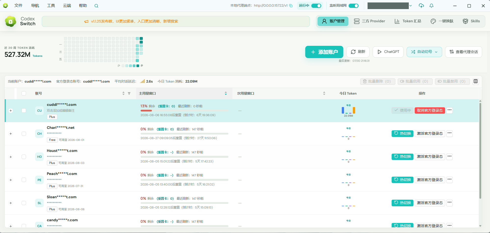
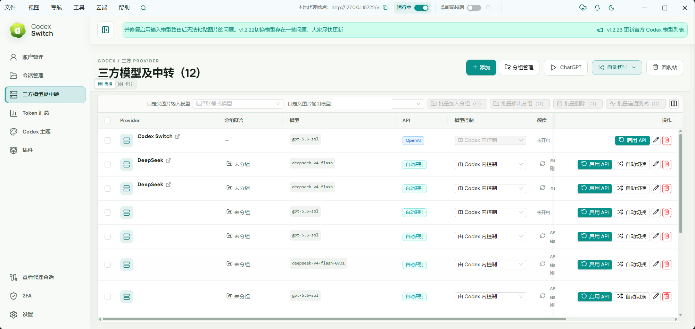
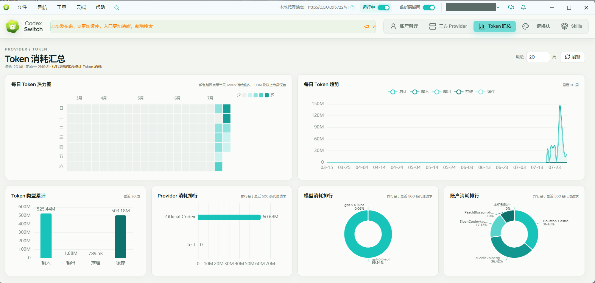
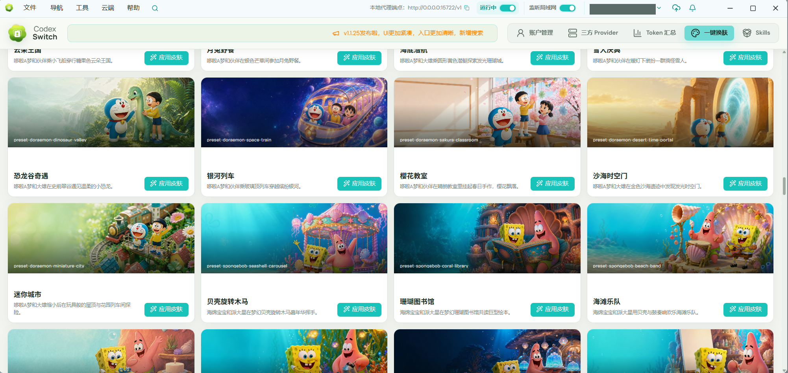
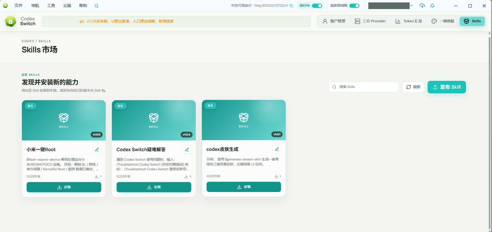
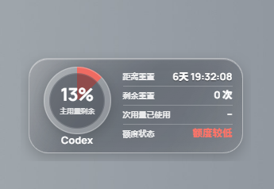

# Codex Switch

> Chinese is the default documentation language. For the Chinese README, see [README.md](README.md).

Codex Switch is a local-first multi-account workspace for Codex / ChatGPT. Its Tauri 2 desktop app is the full management surface and can also serve a local browser UI. Alongside sign-in, usage monitoring, and account switching, it includes third-party Providers, a hot-switching proxy, token analytics, a Skills Market, one-click themes, and optional self-hosted backend/mobile coordination.

[](LICENSE) [](https://github.com/piperhex/codex-switch/releases)

## Screenshots

### Account management and local proxy



### Third-party providers



### Token analytics



### One-click themes

Includes 300+ presets and integrates with [Fei-Away/Codex-Dream-Skin](https://github.com/Fei-Away/Codex-Dream-Skin).



### Skills Market



### Floating usage widgets

<p align="center">
  
  &nbsp;&nbsp;&nbsp;
  
</p>

## Features

- Reuses the Codex CLI OAuth 2.0 + PKCE login flow, with both in-app and system-browser login.
- Imports and manages multiple `auth.json` files, including common third-party JSON exports and multi-account files.
- Atomically switches `$CODEX_HOME/auth.json` (default: `~/.codex/auth.json`) and supports `.cs` account/provider backups.
- Displays plan and expiration details, primary/secondary usage windows, reset credits, daily tokens, and configurable account-table columns.
- Supports manual or scheduled account refreshes, top-menu navigation and search, system-tray switching, and a best-effort **Restart ChatGPT** action.
- Offers compact and glass-style always-on-top usage widgets with quota, reset, and status details.
- Supports OpenAI Responses and Chat Completions-compatible Providers, multiple models, model-control policies, and balance queries for common relay platforms.
- Routes third-party Providers through the loopback proxy on `127.0.0.1:15722` and supports hot switching between official accounts and Providers.
- Records proxy token usage, displays conversation/message details, context consumption and latency, and exports structured diagnostics.
- Provides weekly heatmaps and trends plus token-type, Provider, model, and account rankings.
- Can refresh accounts after quota exhaustion, select an eligible account with the lowest primary-window usage, switch credentials, and retry once.
- Can serve a browser UI on localhost alongside the desktop app, or run it without desktop UI through `--headless --port`.
- Includes a Skills Market for searching and installing community Skills; cloud-signed-in users can publish versioned packages and updates.
- Includes 300+ Dream Skin presets with one-click apply, custom backgrounds, appearance controls, and restore support.
- Groups preferences by appearance, window behavior, usage, network, privacy, and storage, including language,
  accent color, close-to-tray behavior, usage widgets, account refresh, and token analytics.
- Optionally syncs with a self-hosted NestJS backend. The Expo mobile app can refresh official usage/reset credits and switch the active account on a selected online PC.
- Keeps account credentials and Provider secrets in the Rust backend, out of the React UI and application logs.

> [!IMPORTANT]
> Account credentials, Provider API keys, and cloud-login tokens are stored in the application data directory without additional at-rest encryption. A `.cs` backup contains restorable credentials and keys. Cloud sync is opt-in, but enabling it uploads those secrets to the server you configure. Use only trusted devices and self-hosted servers; never commit, share, or publish credential files, backups, or unchecked diagnostics.

## Getting started

### Prerequisites

- Node.js 18 or later
- npm
- Latest stable Rust toolchain
- [Tauri 2 system dependencies](https://v2.tauri.app/start/prerequisites/) for your platform
- WebView2 on Windows and Xcode Command Line Tools on macOS

On Ubuntu, install the Tauri Linux build dependencies:

```bash
sudo apt update
sudo apt install libwebkit2gtk-4.1-dev build-essential curl wget file libxdo-dev libssl-dev libappindicator3-dev librsvg2-dev patchelf xdg-utils
```

Install dependencies and start the desktop app:

```powershell
npm install
npm run dev:app
```

Other common commands:

```powershell
npm run dev
npm run dev:admin
npm run dev:backend
npm run start -w @codex-switch/native
npm run build:app
npm run check
```

The development browser preview uses demo data and never accesses real credentials. The mobile companion requires a deployed cloud backend; it receives redacted summaries plus a short-lived Codex access token for direct usage/reset-credit refreshes, and can switch the account used by a selected online PC. See [the mobile README](apps/native/README.md) and [the admin backend README](apps/admin/README.md).

## Usage

1. Select **Add account** and sign in in the app, through the system browser, or import `auth.json` / a compatible JSON export.
2. Refresh account usage and expand a row to view reset credits.
3. Select **Switch** to atomically replace the `auth.json` currently used by Codex.
4. If a running ChatGPT/Codex process may have cached the old credentials, use **Restart ChatGPT** from the dashboard or tray.

An installed client can start the localhost-only browser UI alongside the desktop interface, or run it without creating a window, tray icon, or floating widget. In headless mode the command-line port applies only to that process:

```powershell
codex-switch.exe --headless --port=18080
# Also supported: codex-switch.exe --headless --port 18080
```

Open `http://127.0.0.1:18080` after startup. `--headless` requires `--port`, whose valid range is `1-65535`.

The **Providers** page manages OpenAI Responses or Chat Completions-compatible endpoints, API keys, models, and model-control policy. Third-party Providers can be used only while the local proxy is running. The proxy listens on `127.0.0.1:15722`, directs Codex to it, and enables hot switching.

The **Skills** page can browse, search, and install community Skills locally. Publishing or updating a versioned Skill package requires a signed-in cloud account. The **One-click themes** page provides 300+ bundled Dream Skin presets plus custom-background and restore controls.

The custom cloud server setting is hidden by default. Self-hosted users can set
`showCustomCloudServer` to `true` in `settings.json` to display it on the Settings page.

## More documentation

- [Architecture and data flow](docs/architecture.md)
- [Development and debugging](docs/development.md)
- [Contributing guide](CONTRIBUTING.md)

## License

Codex Switch is licensed under the [Apache License 2.0](LICENSE), the same license used by the official [OpenAI Codex](https://github.com/openai/codex) repository.

## Disclaimer

Codex Switch is independently developed third-party software and is not affiliated with, associated with, authorized by, endorsed by, or officially partnered with OpenAI or its Codex products.
