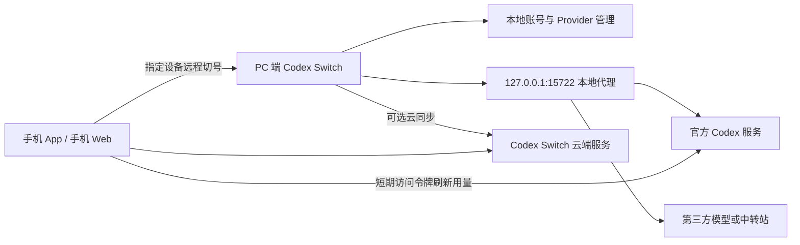

# Codex Switch PC 端与手机端 Bilibili 使用教程合集规划

> 适用版本：Codex Switch v1.2.3（依据 2026-08-16 仓库功能整理）
>
> 用途：作为 Bilibili 合集选题、录屏、口播、章节和简介编写的参考文档。
>
> 核心原则：一集只解决一个明确问题；同一功能中的查看、设置、验证和恢复可以放在同一集。

## 一、合集定位

### 1. 目标观众

- 已经在使用 Codex、ChatGPT 或 Codex CLI，希望管理多个官方账号的用户。
- 需要接入第三方模型、API 中转站或本地模型的用户。
- 希望在手机上查看额度、远程切换 PC 账号的用户。
- 自建 Codex Switch 云端服务并负责账号池、用户或运营管理的管理员。

### 2. 建议拆成五季

| 季 | 内容 | 集数 | 建议受众 |
| --- | --- | ---: | --- |
| 第一季 | PC 端账号管理基础 | 15 | 所有用户 |
| 第二季 | PC 端 Provider 与本地代理 | 14 | 第三方模型、多账号进阶用户 |
| 第三季 | PC 端效率、数据与个性化 | 20 | 高频用户、创作者、排障用户 |
| 第四季 | 手机 App 与手机 Web | 15 | 需要移动管理的用户 |
| 第五季 | 管理员番外 | 19 | 自建服务管理员 |

建议先发布第一季，再根据评论区需求穿插第二季和第四季。管理员番外应明确标注“需要管理员权限和云端服务”，避免普通用户误以为必须部署后端才能使用 PC 端。

### 3. 每集统一结构

每集建议控制在 5～10 分钟，复杂功能可到 12 分钟。录制结构保持一致：

1. **前 15 秒：提出问题。** 例如：“账号额度用完后，怎样自动换到可用账号？”
2. **功能边界：说明能做什么、不能做什么。** 避免把云同步、本地代理和官方 Codex 能力混在一起。
3. **前置条件：只讲本集真正需要的条件。** 例如本地代理、云端登录、在线 PC。
4. **完整操作：从入口开始，演示到结果出现。** 不跳过确认框、等待过程和结果校验。
5. **常见问题：只保留 2～3 个最容易踩的坑。**
6. **结尾：展示最终状态，并预告存在直接依赖的下一集。**

### 4. 录制前准备

- 准备至少 3 个测试账号：一个当前账号、一个备用账号、一个额度较低或异常账号。
- 准备一个可公开展示的第三方 API 测试账号，并提前限制余额或权限。
- 准备两个 Codex 会话、一个 Skill/插件包、一张无文字和水印的主题背景图。
- 手机端演示至少准备一台在线 PC；远程切换时保持桌面端运行并登录同一云端账号。
- 演示删除、批量消耗额度、重置卡、恢复外观前，先制作备份或使用专门测试数据。
- 全程开启隐私模式或后期遮挡邮箱、手机号、密码、2FA 密钥、API Key、`auth.json`、`.cs` 备份内容和本机私人路径。

## 二、观众需要先理解的产品关系



讲解时必须反复强调以下边界：

- PC 端基础账号管理可以完全本地使用，不要求云端登录。
- 第三方 Provider、热切换、代理会话和 Token 统计依赖本地代理。
- Token 统计只包含经过本地代理转发的请求，不代表账号在所有客户端中的完整消耗。
- 手机 App 和手机 Web 依赖云端服务；远程切号还要求目标 PC 在线。
- 云同步会把完整账号凭据和 Provider 密钥发送到所配置的服务器，只能连接可信服务器。
- Codex Switch 是第三方开源软件，不是 OpenAI 官方产品。

## 三、第一季：PC 端账号管理基础

### S1E01 安装与首次启动

- **观众问题：** 从哪里下载，第一次打开后应该先做什么？
- **前置条件：** Windows、macOS 或 Linux；Windows 确认系统具有 WebView2。
- **演示路径：** GitHub Release → 下载对应平台安装包 → 安装 → 启动 Codex Switch。
- **操作步骤：**
  1. 说明 Windows x64、Windows ARM64、Linux、macOS Apple Silicon/Intel 的区别。
  2. 安装并启动，展示主界面、版本信息和空账号状态。
  3. 打开“帮助/关于”，确认当前版本和项目仓库。
  4. 说明本地数据与 Codex 目录分别保存什么，但不要打开真实凭据。
- **讲解重点：** PC 端本地模式不需要注册云端账号；云同步是可选功能。
- **常见问题：** macOS 未公证提示、Windows WebView2 缺失、下载了错误架构。
- **建议时长：** 6～8 分钟。

### S1E02 界面导航与入口搜索

- **观众问题：** 功能入口很多，怎样快速找到？
- **演示路径：** 顶部导航、文件/导航/工具/云端/帮助菜单、放大镜入口搜索。
- **操作步骤：**
  1. 依次展示账户、会话、三方模型及中转、Token 汇总、Codex 主题、插件六个主页面。
  2. 展示设置、通知、帮助、云端入口所在位置。
  3. 使用放大镜搜索“刷新全部用量”“网络代理”“打开 Token 窗口”等操作。
  4. 说明托盘和悬浮球是主窗口之外的快捷入口，后续单独讲解。
- **讲解重点：** 本集只讲“找入口”，不要提前展开每个功能的原理。
- **建议时长：** 5 分钟。

### S1E03 使用 OAuth 添加或更新官方账号

- **观众问题：** 怎样安全添加官方 Codex/ChatGPT 账号？
- **演示路径：** 账户管理 → 添加/更新账户 → 应用内登录或默认浏览器。
- **操作步骤：**
  1. 先演示“在应用内登录”，完成 ChatGPT 授权并等待账号出现在列表。
  2. 再说明企业 SSO、内嵌页面受限时改用“使用默认浏览器”。
  3. 对同一账号再次授权，展示“更新已有账户”而不是产生重复记录。
  4. 刷新该账号用量，确认账号可正常使用。
- **讲解重点：** OAuth 使用 PKCE；Token 不会显示在前端界面或日志中。
- **常见问题：** 本地回调端口被占用、内嵌登录失败、浏览器授权后没有自动返回。
- **建议时长：** 8～10 分钟。

### S1E04 导入已有账号 JSON

- **观众问题：** 已经有 `auth.json` 或其他工具导出的 JSON，怎样批量导入？
- **演示路径：** 添加/更新账户 → 多格式导入 / 从剪贴板导入。
- **操作步骤：**
  1. 演示选择标准 `auth.json` 文件。
  2. 演示兼容对象、数组、`{ "accounts": [...] }`、逐行 JSON 和常见令牌字段。
  3. 演示从剪贴板导入，说明刷新令牌格式可先尝试换取有效凭据。
  4. 导入后核对账号数量、邮箱和用量；失败时展示可理解的错误信息。
- **讲解重点：** 只用脱敏的测试文件；不要在视频里打开或逐字展示真实 JSON。
- **建议时长：** 7～9 分钟。

### S1E05 查看并刷新账号用量

- **观众问题：** 怎样看主用量窗口、次用量窗口、重置时间和今日 Token？
- **演示路径：** 账户管理 → 刷新单个账号 / 顶部“刷新全部用量”。
- **操作步骤：**
  1. 解释主、次用量窗口的剩余比例和重置时间。
  2. 展示套餐、账号类型、预设截止日期、错误状态和最后刷新时间。
  3. 演示单账号刷新、全部账号刷新，以及只刷新重置卡。
  4. 说明今日 Token 只有代理运行并产生请求后才有数据。
- **讲解重点：** “接口额度”和“代理统计 Token”是两类不同数据。
- **建议时长：** 7 分钟。

### S1E06 管理账号资料

- **观众问题：** 怎样给账号保存备注、截止日期和登录辅助资料？
- **演示路径：** 双击账号备注，或更多操作 → 编辑账号资料。
- **操作步骤：**
  1. 设置预设可用截止日期和备注。
  2. 填写手机号、密码和账号绑定的 2FA 密钥。
  3. 导入 Authenticator 二维码，预览并复制当前验证码。
  4. 保存后回到列表，确认备注和更早的有效截止日期正确显示。
- **讲解重点：** 这些是敏感资料；云同步开启后会同步到所配置服务器。官方账号池字段可能由管理员维护而只读。
- **建议时长：** 8～10 分钟。

### S1E07 切换、热切换与取消使用账号

- **观众问题：** 怎样让 Codex 使用另一个官方账号？
- **演示路径：** 账户行 → 切换并重启 / 热切换 / 取消使用。
- **操作步骤：**
  1. 在未启用代理时点击“切换并重启”，确认当前账号变化。
  2. 启用代理后展示“热切换”，说明不需要重启的差异。
  3. 打开 Codex/ChatGPT 发起一次测试请求，验证目标账号。
  4. 演示“取消使用”，说明账号仍保留在列表中。
- **讲解重点：** 普通切换会原子替换 `$CODEX_HOME/auth.json`；运行中的客户端可能缓存旧登录态。
- **常见问题：** Agent Identity 与 OAuth Token 账号的代理兼容性不同。
- **建议时长：** 8 分钟。

### S1E08 查看与使用重置卡

- **观众问题：** 怎样查看重置卡数量、有效期并安全使用？
- **演示路径：** 展开账号 / 更多操作 → 查看重置卡 → 使用重置卡。
- **操作步骤：**
  1. 刷新重置卡，展示发放时间、到期时间和当前可用数量。
  2. 选择测试账号点击“使用重置卡”，完整展示二次确认。
  3. 操作后重新读取重置卡与用量，验证结果。
- **讲解重点：** 使用重置卡会产生真实消耗，不要用主力账号做不可控演示。
- **建议时长：** 5～7 分钟。

### S1E09 批量管理账号

- **观众问题：** 账号很多时怎样统一启用、禁用、删除或触发用量？
- **演示路径：** 勾选多行 → 批量启用 / 批量禁用 / 批量删除 / 批量消耗额度。
- **操作步骤：**
  1. 勾选多个备用账号并批量启用或停用自动切换资格。
  2. 演示批量删除只移除本地记录，不会注销 ChatGPT 账号。
  3. 单独解释“批量消耗额度”会依次发送“今天天气如何？”并刷新用量与重置时间。
  4. 展示列设置、拖动列顺序和表格/卡片展示模式。
- **讲解重点：** 批量消耗额度是有真实请求成本的高级操作；必须单独给出醒目提示。
- **建议时长：** 8～10 分钟。

### S1E10 导出与恢复 `.cs` 备份

- **观众问题：** 换电脑或误删配置后怎样恢复？
- **演示路径：** 文件 → 导出备份 / 导入备份。
- **操作步骤：**
  1. 导出包含本地账号、备注、用量和 Provider 的 `.cs` 文件。
  2. 在测试环境删除一条记录，再导入备份并验证合并结果。
  3. 说明重复记录按稳定标识合并，能恢复的当前状态会被恢复。
  4. 给出安全保存建议：离线加密盘、密码管理器附件或受控备份目录。
- **讲解重点：** `.cs` 包含可恢复的账号凭据和 Provider 密钥，不是可公开分享的脱敏文件。
- **建议时长：** 7～9 分钟。

### S1E11 系统托盘快捷控制

- **观众问题：** 不打开主窗口时怎样切号或重启 ChatGPT？
- **演示路径：** Windows/macOS/Linux 托盘图标 → 显示控制台、切换账号、重启 ChatGPT、退出。
- **操作步骤：**
  1. 最小化或关闭主窗口，确认应用仍在托盘运行。
  2. 从托盘切换测试账号并重新打开控制台核对结果。
  3. 演示“重启 ChatGPT”和“退出 Codex Switch”的区别。
- **讲解重点：** 重启 ChatGPT 是尽力而为的本地操作，依赖系统能发现并重新启动客户端。
- **建议时长：** 5 分钟。

### S1E12 设置自动刷新

- **观众问题：** 怎样让账号用量和 Provider 余额自动更新？
- **演示路径：** 设置 → 全局用量自动刷新 / 当前账户或 Provider 自动刷新。
- **操作步骤：**
  1. 开启全局刷新并设置间隔，说明会刷新全部账号和已配置余额查询的 Provider。
  2. 开启当前目标独立刷新，展示当前目标是谁。
  3. 在多账户并发模式下说明独立刷新会覆盖所有已启用账号。
  4. 等待一次定时触发，验证最后更新时间变化。
- **讲解重点：** 不要把间隔设得过短；定时任务不会重叠执行。
- **建议时长：** 6 分钟。

### S1E13 使用悬浮用量球

- **观众问题：** 工作时怎样不打开主窗口也能看到当前额度？
- **演示路径：** 设置 → 悬浮用量球。
- **操作步骤：**
  1. 开启悬浮球，选择经典圆球或玻璃信息卡。
  2. 选择重置时间显示为倒计时或具体时间。
  3. 演示拖动、悬停展开、左键刷新和右键快捷菜单。
  4. 切换到第三方 Provider，展示余额和 Token 统计卡片的变化。
- **讲解重点：** 悬浮球显示当前账号主窗口；第三方卡片依赖对应余额配置和代理数据。
- **建议时长：** 6～8 分钟。

### S1E14 云端注册、登录与同步

- **观众问题：** 怎样把 PC 账号同步给其他 PC 或手机使用？
- **前置条件：** 可信的 Codex Switch 云端服务地址。
- **演示路径：** 设置 → 云同步服务器 → 保存；顶部云端 → 注册/登录 → 云同步。
- **操作步骤：**
  1. 使用项目默认云端服务器，或填写自建 HTTPS Base URL。
  2. 演示邮箱验证码注册、登录、记住密码和忘记密码入口。
  3. 手动同步，确认账号和 Provider 在服务器与本机之间合并。
  4. 展示账户信息、修改密码和退出登录。
- **讲解重点：** 项目默认云端服务器不等于 OpenAI 官方服务；退出云端不会删除本地数据或云端已有数据。
- **安全提示：** 开启同步会上传完整账号凭据和 Provider 密钥。
- **建议时长：** 10～12 分钟。

### S1E15 使用云同步回收站

- **观众问题：** 已同步账号或 Provider 被误删后怎样找回？
- **前置条件：** 已登录云端账号，并已启动本地代理以显示回收站入口。
- **演示路径：** 账户或 Provider 顶部操作 → 回收站。
- **操作步骤：**
  1. 删除一条专用测试记录并打开回收站。
  2. 按账号、三方模型或关键词筛选。
  3. 查看删除时间和详情，执行恢复。
  4. 回到对应页面确认记录重新出现。
- **讲解重点：** 这是云同步回收站，不等同于 Codex 会话回收站。
- **建议时长：** 5～6 分钟。

## 四、第二季：PC 端 Provider 与本地代理

### S2E01 启动与停止本地代理

- **观众问题：** 为什么三方模型和热切换都要求先开代理？
- **演示路径：** 顶部本地代理开关 → 启动代理 / 停止代理。
- **操作步骤：**
  1. 展示默认端点 `127.0.0.1:15722/v1` 并复制地址。
  2. 启动代理，完整展示准备客户端、更新配置、同步对话、重启客户端的进度。
  3. 发起一次官方模型请求，确认请求经过代理。
  4. 停止代理，等待恢复非代理对话和官方配置。
- **讲解重点：** 首次启动和停止可能处理大量会话文件；不要在进度中途强制退出。
- **建议时长：** 8～10 分钟。

### S2E02 使用模型预设添加 Provider

- **观众问题：** 不熟悉接口参数时怎样快速接入常见模型？
- **演示路径：** 三方模型及中转 → 添加 → 添加模型预设。
- **操作步骤：**
  1. 展示 Antigravity、Claude Code、DeepSeek、Grok 等专用预设。
  2. 展示 OpenRouter、Kimi、Gemini、百炼、Ollama、LM Studio、GLM、MiniMax、Mistral、火山方舟等目录预设。
  3. 选择一个测试预设，填写节点和 API Key，自动获取模型。
  4. 保存后核对 API 格式、模型列表和就绪状态。
- **讲解重点：** 节点地域、计费方案和 API Key 必须匹配；本地模型地址通常需要以 `/v1` 结尾。
- **建议时长：** 10～12 分钟。

### S2E03 手动添加自定义 Provider

- **观众问题：** 列表里没有的兼容接口怎样接入？
- **演示路径：** 三方模型及中转 → 添加 → 添加 Provider。
- **操作步骤：**
  1. 填写名称、Base URL、API Key、模型列表和当前模型。
  2. 选择 OpenAI Responses 或 Chat Completions 转换格式。
  3. 设置支持图片输入的模型、上下文窗口和推理级别。
  4. 可选配置 API 余额、钱包余额查询地址和鉴权方式。
  5. 保存并用测试请求验证工具调用和流式输出。
- **讲解重点：** Chat Completions 会经过协议桥接；并非所有兼容接口都支持 Codex 所需的工具调用。
- **建议时长：** 10～12 分钟。

### S2E04 添加 New API 或 Sub2API 中转站

- **观众问题：** 怎样用站点地址和 API Token 自动拉取中转模型？
- **演示路径：** 三方模型及中转 → 添加 → 添加中转站。
- **操作步骤：**
  1. 选择 New API 或 Sub2API，填写站点地址和 API Token。
  2. 自动拉取模型并选择当前模型。
  3. 展开高级设置，按需调整名称、Base URL、余额和钱包查询。
  4. 保存后刷新余额并发送测试请求。
- **讲解重点：** 不同中转站的模型能力可能与名称不一致，必须实际验证文本、工具和图片能力。
- **建议时长：** 8～10 分钟。

### S2E05 添加上游 Codex Switch

- **观众问题：** 怎样把另一台 Codex Switch 暴露的代理作为上游使用？
- **演示路径：** 三方模型及中转 → 添加 → 添加上游 Codex Switch。
- **操作步骤：**
  1. 在上游设备开启局域网代理和 API Key。
  2. 在当前设备填写上游 `/v1` 地址和 API Key。
  3. 保存后确认模型列表、上下文限制和官方 Codex 配置被继承。
  4. 发起一次请求并说明链路中两层设备的职责。
- **讲解重点：** 只在可信局域网或受保护网络中使用，不能公开暴露无鉴权端点。
- **建议时长：** 7～9 分钟。

### S2E06 切换 Provider、模型与控制方式

- **观众问题：** 怎样在官方账号和第三方模型之间切换？
- **前置条件：** 本地代理已运行。
- **演示路径：** Provider 行 → 热切换；模型下拉框；模型控制方式。
- **操作步骤：**
  1. 从官方账号切换到测试 Provider，验证当前状态变化。
  2. 在同一 Provider 内热切换模型。
  3. 对比“由 Codex 控制模型”和“由 Codex Switch 固定模型”。
  4. 切回官方账号，必要时展示重启提示。
- **讲解重点：** Provider 未启用代理时不能切换；模型控制策略会影响 Codex 内部的模型选择。
- **建议时长：** 8 分钟。

### S2E07 查看 Provider 余额与 Token 快速统计

- **观众问题：** 怎样在一个页面判断哪个中转站还能用？
- **演示路径：** Provider 列表 → 余额刷新、今日 Token、累计 Token。
- **操作步骤：**
  1. 为测试 Provider 配置余额查询并刷新。
  2. 区分 API 余额、钱包余额、无限额度、未配置和查询失败。
  3. 运行几次代理请求，展示今日 Token 和累计 Token 更新。
  4. 切换表格/卡片视图，演示批量删除无效 Provider。
- **讲解重点：** 余额由上游接口返回，Token 由本地代理统计，两者来源不同。
- **建议时长：** 6～8 分钟。

### S2E08 额度耗尽后自动切号

- **观众问题：** 当前官方账号没额度后，怎样自动换号并重试？
- **前置条件：** 本地代理运行；至少两个可用官方账号。
- **演示路径：** 顶部“自动切号” → 开启；账号行 → 启用/停用自动切换。
- **操作步骤：**
  1. 开启自动切号，说明只在官方账号模式生效。
  2. 设置哪些账号参加自动切换。
  3. 可选开启自定义优先级，解释数字越小越优先。
  4. 可选开启按 HTTP 状态码自动禁用，并在设置中配置 401/402/403 等状态码。
  5. 指定兜底 Provider，演示没有可用官方账号时的处理。
- **讲解重点：** 触发后会刷新账号用量、选择候选账号并只重试当前请求一次。
- **建议时长：** 10～12 分钟。

### S2E09 多账户并发路由

- **观众问题：** 怎样让不同新对话分散到多个官方账号？
- **前置条件：** 本地代理运行；多个账号已启用。
- **演示路径：** 账户管理 → 多账户并发开关。
- **操作步骤：**
  1. 开启多个账号的自动切换资格，再开启多账户并发。
  2. 新建多个对话，观察对话分别绑定到不同账号。
  3. 在同一对话继续追问，验证始终使用原账号。
  4. 关闭并发，说明已有会话绑定与新会话分配的区别。
- **讲解重点：** 并发路由按“对话”分配，不是把同一次请求拆给多个账号。
- **建议时长：** 8～10 分钟。

### S2E10 设置官方登录态账号

- **观众问题：** 代理模式下手机远控或依赖官方登录的插件能力缺失怎么办？
- **演示路径：** 账户行 → 激活官方登录态。
- **操作步骤：**
  1. 选择一个兼容 OAuth 账号作为 OpenAI 官方登录态，等待客户端重启。
  2. 验证手机远控或依赖官方登录的插件能力恢复。
  3. 在设备状态和账户顶部摘要中核对当前官方登录态。
  4. 取消官方登录态，等待客户端重启并验证结果。
- **讲解重点：** 官方登录态账号和对话请求账号是两个不同概念；不要把它说成普通切号。
- **建议时长：** 7～9 分钟。

### S2E11 设置图片生成账号

- **观众问题：** 怎样让图片生成和编辑使用指定官方账号，又不改变当前对话账号？
- **前置条件：** 本地代理运行；至少一个支持图片能力的 OAuth 账号。
- **演示路径：** 账户管理或 Provider 页面 → 图片账号。
- **操作步骤：**
  1. 选择一个 OAuth 账号作为图片生成账号。
  2. 保持另一个账号或 Provider 作为当前对话目标。
  3. 发起一次图片生成或编辑请求，核对路由结果。
  4. 清除图片账号选择并说明默认行为。
- **讲解重点：** 图片账号只负责图片生成和编辑，不会切换普通对话账号。
- **建议时长：** 6～8 分钟。

### S2E12 向局域网开放本地代理

- **观众问题：** 怎样让同一局域网的其他设备使用 PC 上的代理？
- **演示路径：** 顶部本地代理 → 监听局域网。
- **操作步骤：**
  1. 开启监听 `0.0.0.0`，生成并复制高强度 API Key。
  2. 在另一台设备使用 PC 局域网 IP、端口和 Bearer Token 或 `X-API-Key`。
  3. 发起测试请求，确认本机请求无需 Key、远程请求必须鉴权。
  4. 演示关闭局域网监听。
- **讲解重点：** 路由器端口转发、公网暴露和弱口令都不属于安全用法。
- **建议时长：** 8 分钟。

### S2E13 查看代理会话与请求详情

- **观众问题：** 怎样判断一个对话正在用哪个账号、模型和多少上下文？
- **演示路径：** 账户或 Provider 顶部 → 查看代理会话。
- **操作步骤：**
  1. 展示对话标题、连接、目标账号/模型、上下文 Token 和活动状态。
  2. 打开请求详情，查看模型、推理级别、首次响应、总响应时间和 Token。
  3. 解释活跃/空闲、统计中、等待用量数据等状态。
  4. 用该页面定位一次故意制造的慢请求。
- **讲解重点：** 最多展示/保留的请求有上限；成功响应正文和凭据不会作为普通诊断内容记录。
- **建议时长：** 8～10 分钟。

### S2E14 导出代理诊断日志

- **观众问题：** Provider 请求失败时怎样准备可用的排障材料？
- **演示路径：** 工具 → 导出日志，或设置 → 诊断日志。
- **操作步骤：**
  1. 复现一次测试 Provider 错误。
  2. 导出结构化诊断文件并说明应检查的状态码、目标和时间。
  3. 分享前检查上游错误信息和本机环境信息。
  4. 配合代理会话页说明“界面排查”和“日志排查”的分工。
- **讲解重点：** 日志设计上会避开授权头和正常请求正文，但仍必须在分享前人工检查。
- **建议时长：** 6～8 分钟。

## 五、第三季：PC 端效率、数据与个性化

### S3E01 Token 消耗汇总

- **观众问题：** 怎样看长期 Token 趋势和消耗排名？
- **前置条件：** 已开启本地代理并产生请求。
- **演示路径：** Token 汇总。
- **操作步骤：**
  1. 设置最近多少周，并手动刷新统计。
  2. 解读每日热力图和总量、输入、输出、推理、缓存趋势。
  3. 查看 Provider、模型和账号消耗排名。
  4. 打开独立 Token 窗口，说明与内嵌页面数据一致。
- **讲解重点：** 排名基于代理观察到的请求，不是 OpenAI 或中转站完整账单。
- **建议时长：** 8～10 分钟。

### S3E02 浏览与搜索本地 Codex 会话

- **观众问题：** 对话很多时怎样按项目和内容查找？
- **演示路径：** 会话管理。
- **操作步骤：**
  1. 按工作目录展开会话组，查看标题、时间和 Token。
  2. 搜索标题或会话内容，并观察命中片段高亮。
  3. 按普通对话、外部会话、子代理筛选。
  4. 打开所在目录、rollout 文件或复制会话 ID。
- **讲解重点：** 这是本地 Codex 会话文件管理，不是云端 ChatGPT 对话列表。
- **建议时长：** 7～9 分钟。

### S3E03 使用 Codex 会话回收站

- **观众问题：** 怎样删除本地会话又保留恢复机会？
- **演示路径：** 会话管理 → 勾选 → 移动到回收站 → 回收站。
- **操作步骤：**
  1. 把测试会话移动到本地回收站。
  2. 在回收站恢复会话并核对列表。
  3. 演示永久删除和清空回收站的确认提示。
- **讲解重点：** 永久删除无法恢复；它与云同步账号回收站是两套功能。
- **建议时长：** 5～7 分钟。

### S3E04 导入与导出 Codex 会话

- **观众问题：** 怎样在两台电脑之间迁移部分 Codex 会话？
- **演示路径：** 会话管理 → 导入/导出。
- **操作步骤：**
  1. 勾选会话并预览可导出数量和包大小。
  2. 导出会话包，说明只包含 rollout 文件和本地索引。
  3. 在另一环境导入，处理“已存在”和“可导入”状态。
  4. 验证重复 ID 会跳过，不覆盖本地内容。
- **讲解重点：** 会话包不包含账号、Token、API Key 或应用设置。
- **建议时长：** 7～9 分钟。

### S3E05 修复 Codex 会话不可见

- **观众问题：** 切号或换 API Key 后，旧会话为什么不在侧栏显示？
- **演示路径：** 会话管理 → 修复可见性。
- **操作步骤：**
  1. 先使用“查看影响范围”，确认预计更新的数据库、索引和文件数量。
  2. 对全部或所选会话执行快速修复。
  3. 快速修复无效时再执行深度修复。
  4. 重新打开 Codex 验证侧栏。
- **讲解重点：** 深度修复会重建本地会话索引，应先预览并优先用快速修复。
- **建议时长：** 8～10 分钟。

### S3E06 安装社区 Skill

- **观众问题：** 怎样从社区市场给 Codex 增加专门能力？
- **演示路径：** 插件 → 社区插件。
- **操作步骤：**
  1. 搜索并打开插件详情，查看作者、版本、简介和下载量。
  2. 安装一个测试 Skill，确认本地安装结果。
  3. 市场出现新版本时执行更新。
  4. 在 Codex 中使用该 Skill 完成一个最小示例。
- **讲解重点：** 安装前阅读 `SKILL.md` 的用途和操作范围；第三方 Skill 可能指导 Codex 执行本地或联网操作。
- **建议时长：** 7～9 分钟。

### S3E07 管理官方插件

- **观众问题：** 怎样安装、启用、禁用和卸载官方插件？
- **演示路径：** 插件 → 官方插件。
- **操作步骤：**
  1. 搜索官方插件并执行安装。
  2. 演示启用、禁用和重新启用。
  3. 卸载测试插件并确认状态变化。
- **讲解重点：** “已安装”和“已启用”不是同一状态；官方插件操作要求本机桌面环境。
- **建议时长：** 6～8 分钟。

### S3E08 发布或更新社区插件

- **观众问题：** 怎样把自己的 Skill 发布到社区市场？
- **前置条件：** 已登录云端账号。
- **演示路径：** 插件 → 社区插件 → 发布插件。
- **操作步骤：**
  1. 准备只包含一个 `SKILL.md` 的 ZIP 或文件夹。
  2. 填写标题、版本、简介，选择可选预览图。
  3. 说明压缩后插件包和预览图大小限制。
  4. 发布后搜索自己的插件，再演示发布新版本。
- **讲解重点：** 发布前清除凭据、私人路径、测试垃圾文件和无权分发的素材。
- **建议时长：** 8～10 分钟。

### S3E09 安装 Dream Skin 并应用主题

- **观众问题：** 怎样一键改变官方 Codex 桌面端外观？
- **前置条件：** Windows 或 macOS，已安装官方 Codex/ChatGPT 桌面客户端。
- **演示路径：** Codex 主题 → 安装运行时 → 内置主题或社区主题。
- **操作步骤：**
  1. 首次安装运行时，保存未完成工作并允许客户端重启。
  2. 选择内置主题并应用，确认侧栏、输入框和任务内容可读。
  3. 搜索社区主题，查看作者、下载量、大小和来源。
  4. 安装并应用社区主题，演示更新已安装主题。
- **讲解重点：** 主题通过本机回环注入，不修改官方应用包、签名、账号或对话。
- **建议时长：** 10～12 分钟。

### S3E10 使用自己的图片创建主题

- **观众问题：** 怎样把一张壁纸变成可读性良好的 Codex 主题？
- **演示路径：** Codex 主题 → 使用自己的图片。
- **操作步骤：**
  1. 选择 PNG、JPEG、WebP、HEIC 或 TIFF 背景图。
  2. 设置主题名称、界面明暗、内容安全区和任务页图片模式。
  3. 必要时调整横向、纵向焦点并创建应用。
  4. 在“已保存主题”中再次切换该主题。
- **讲解重点：** 图片不要带窗口边框、UI、可读文字、Logo 或水印；优先使用“自动”构图。
- **建议时长：** 8～10 分钟。

### S3E11 Dream Skin 自检、暂停与恢复官方外观

- **观众问题：** 主题异常时怎样检查、重载或彻底恢复？
- **演示路径：** Codex 主题 → 运行时控制。
- **操作步骤：**
  1. 演示暂停、继续显示和重新应用。
  2. 保存当前主题、切换明暗、打开皮肤目录。
  3. 运行自检并解释成功/失败结果。
  4. 使用“恢复官方外观”，等待客户端重启并验证。
- **讲解重点：** 恢复官方外观会移除当前皮肤，但不影响模型切换功能。
- **建议时长：** 7～9 分钟。

### S3E12 使用桌面 2FA 验证码管理器

- **观众问题：** 怎样在 Codex Switch 内保存和复制多个动态验证码？
- **演示路径：** 账户页顶部 → 2FA。
- **操作步骤：**
  1. 手动添加服务名称、账号和 Base32 密钥或 `otpauth://` 地址。
  2. 通过二维码图片自动识别并确认参数。
  3. 搜索账号、按服务筛选、点击复制验证码。
  4. 编辑或删除测试密钥。
- **讲解重点：** 独立 2FA 管理器与“账号资料中绑定的 2FA”用途相关但入口不同。
- **建议时长：** 8 分钟。

### S3E13 设置隐私模式

- **观众问题：** 录屏或共享屏幕时怎样隐藏账号和备注？
- **演示路径：** 设置 → 隐私模式。
- **操作步骤：**
  1. 开启“隐藏账号信息”，回到账户页查看邮箱遮罩。
  2. 单独开启“隐藏备注”，核对备注区域。
  3. 前往 Provider、悬浮球和其他可能显示账号的区域检查效果。
  4. 关闭两个选项，说明它们可以独立控制。
- **讲解重点：** 隐私模式只遮挡界面显示，不会加密本地凭据文件。
- **建议时长：** 5～7 分钟。

### S3E14 设置语言、主题色和展示模式

- **观众问题：** 怎样调整界面语言、强调色和账号列表布局？
- **演示路径：** 设置 → 语言、主题色、账号展示模式。
- **操作步骤：**
  1. 在中文和英文之间切换，核对独立窗口中的语言同步。
  2. 修改主题强调色，观察导航、按钮和选中行。
  3. 在表格和卡片模式之间切换账户及 Provider 页面。
  4. 调整表格列顺序，确认本地设置会保留。
- **讲解重点：** 这些是本机界面偏好，不会改变账号、Provider 或云端数据。
- **建议时长：** 6～8 分钟。

### S3E15 启动本机网页版与无界面模式

- **观众问题：** 怎样在浏览器中使用 PC 端界面，或让程序后台提供网页？
- **演示路径：** 设置 → 网页版 Codex Switch 监听端口；命令行 `--headless --port`。
- **操作步骤：**
  1. 在桌面界面填写端口并打开 `http://127.0.0.1:端口`。
  2. 修改端口并演示关闭网页版。
  3. 使用 `codex-switch.exe --headless --port=18080` 启动无界面模式。
  4. 说明无界面模式不会创建主窗口、托盘或悬浮球。
- **讲解重点：** 该网页默认只监听本机，不是手机远程控制 Web；后者使用独立云端 Web 客户端。
- **建议时长：** 7～9 分钟。

### S3E16 为 Codex Switch 设置网络代理

- **观众问题：** 软件访问 OAuth、用量或云端接口失败时怎样走 HTTP 代理？
- **演示路径：** 工具 → 网络代理，或设置 → 网络代理。
- **操作步骤：**
  1. 开启代理，分别填写不含端口/路径的 HTTP 地址和端口。
  2. 保存后刷新一个测试账号或检查更新。
  3. 故意输入非法端口，展示校验提示。
  4. 关闭代理并说明恢复系统原有网络规则。
- **讲解重点：** 这是 Codex Switch 自身联网代理，不等于 `127.0.0.1:15722` 模型路由代理。
- **建议时长：** 6～8 分钟。

### S3E17 检查更新与下载手机 App

- **观众问题：** 怎样升级桌面端并获取匹配的 Android 安装包？
- **演示路径：** 顶部账户菜单或帮助 → 检查更新 / 下载 Android App / 关于。
- **操作步骤：**
  1. 检查新版本，查看版本号和更新说明。
  2. 演示后台下载、下载进度、准备安装和重启安装。
  3. 打开 Android 下载入口，说明 iOS 构建的签名限制。
  4. 更新后回到关于页核对版本。
- **讲解重点：** 更新前结束重要任务；不要从不明镜像下载带凭据管理能力的软件。
- **建议时长：** 6～8 分钟。

### S3E18 查看通知

- **观众问题：** 怎样查看版本公告、活动或维护消息？
- **演示路径：** 顶部铃铛 → 通知面板。
- **操作步骤：**
  1. 展示未读提示并打开通知列表。
  2. 查看通知时间、双语内容和可选链接。
  3. 打开一条外部链接，说明失败不会阻塞软件使用。
  4. 关闭后再次打开，确认已读状态。
- **建议时长：** 4～6 分钟。

### S3E19 使用帮助与 FAQ

- **观众问题：** 遇到常见问题时怎样先在软件内找到答案？
- **演示路径：** 帮助 → 使用帮助。
- **操作步骤：**
  1. 打开帮助窗口并浏览云端下发的 FAQ。
  2. 展开与账号登录、本地代理、移动端等主题相关的问题。
  3. 展示项目仓库、关于和版本信息入口。
  4. 说明 FAQ 无法解决时再进入问题反馈。
- **讲解重点：** 帮助内容可能随服务器更新，不必升级客户端才能看到新的 FAQ。
- **建议时长：** 5～6 分钟。

### S3E20 提交问题反馈

- **观众问题：** 怎样提交一份维护者能够复现和回复的反馈？
- **演示路径：** 帮助或顶部账户菜单 → 问题反馈。
- **操作步骤：**
  1. 按“现象—复现步骤—预期结果—实际结果”填写问题。
  2. 确认软件会附带版本和平台信息。
  3. 添加最多 4 张 JPEG、PNG 或 WebP 图片并提交。
  4. 说明登录状态会绑定已验证邮箱，未登录提交为匿名反馈。
- **讲解重点：** 截图必须遮挡账号、Token、API Key、路径和私人对话；单张图片有大小限制。
- **建议时长：** 6～8 分钟。

## 六、第四季：手机 App 与手机 Web

### S4E01 安装手机 App 并登录云端

- **观众问题：** 手机端怎样连接自己的 Codex Switch 数据？
- **前置条件：** 已部署或可用的 Codex Switch 云端服务；已注册云端账号。
- **演示路径：** 安装 Android APK 或签名后的 iOS App → 登录页。
- **操作步骤：**
  1. 展示默认项目云端服务器地址和“使用官方服务器”恢复入口。
  2. 自建用户填写 HTTPS 根地址、邮箱和密码登录。
  3. 登录后展示账号、设备、2FA、设置四个底部入口。
  4. 说明登录令牌保存在 iOS Keychain/Android Keystore 支持的安全存储中。
- **讲解重点：** GitHub Release 中未签名的 iOS `.app.zip` 不是可直接安装的 App Store 包。
- **建议时长：** 7～9 分钟。

### S4E02 在手机上添加或更新官方账号

- **观众问题：** 离开电脑后能否直接添加 ChatGPT 账号？
- **演示路径：** 账号 → 添加账户 → 无痕授权窗口。
- **操作步骤：**
  1. 打开独立 WebView 完成 ChatGPT OAuth。
  2. 等待“正在安全保存账户”完成。
  3. 回到账户页下拉同步，确认新账号出现。
  4. PC 端执行云同步，确认账号同步到桌面。
- **讲解重点：** 授权窗口不保留网页登录状态；授权失败可重新打开，过期会要求重新授权。
- **建议时长：** 7～9 分钟。

### S4E03 查看和刷新手机账号用量

- **观众问题：** 手机上怎样快速判断哪个账号还有额度？
- **演示路径：** 账号 → 刷新用量 / 点击账号卡片。
- **操作步骤：**
  1. 展示列表中的套餐、主用量和重置倒计时。
  2. 点击卡片查看主、次用量、到期时间、账号 ID 和使用该账号的设备。
  3. 演示刷新单个账号、刷新全部账号、下拉同步服务器资料。
  4. 开关“隐藏信息”，展示邮箱遮罩。
- **讲解重点：** 手机会先取账号摘要和短期 access token，再直接向 Codex 刷新用量；最多并发处理 4 个账号。
- **建议时长：** 7～9 分钟。

### S4E04 在手机上查看和使用重置卡

- **观众问题：** 不在电脑旁时怎样管理重置卡？
- **演示路径：** 账号详情 → 重置卡。
- **操作步骤：**
  1. 查看可用张数、发放时间和到期时间。
  2. 点击使用，完整展示确认提示。
  3. 使用后刷新重置卡和账号用量。
- **讲解重点：** 手机直连 Codex 使用重置卡；这是不可随意撤销的真实操作。
- **建议时长：** 5～7 分钟。

### S4E05 从手机远程切换指定 PC 的账号

- **观众问题：** 多台 PC 在线时，怎样只控制其中一台？
- **前置条件：** 手机和 PC 登录同一云端账号；目标 PC 在线。
- **演示路径：** 账号卡片“切换” → 选择目标设备。
- **操作步骤：**
  1. 选择要切换到的账号。
  2. 在设备抽屉中选择一台在线 PC。
  3. 等待切换成功，观察设备当前账号变化。
  4. 在目标 PC 发起测试请求，确认其他 PC 不受影响。
- **讲解重点：** 远程命令按设备 ID 下发，不会同时切换同一用户的所有电脑。
- **建议时长：** 7～9 分钟。

### S4E06 在手机上管理账号私密资料

- **观众问题：** 怎样在手机上记录账号登录辅助资料？
- **演示路径：** 账号详情 → 账号资料。
- **操作步骤：**
  1. 编辑预设截止日期、备注和手机号。
  2. 查看/隐藏并复制密码。
  3. 输入或扫码导入账号绑定 2FA，预览验证码。
  4. 保存后下拉同步，并在 PC 端核对数据。
- **讲解重点：** 管理员维护的账号池字段可能只读；私密资料同步到可信云端后才能跨设备使用。
- **建议时长：** 8～10 分钟。

### S4E07 管理已登录 PC 设备

- **观众问题：** 怎样查看哪台电脑在线，并删除废弃设备？
- **演示路径：** 设备。
- **操作步骤：**
  1. 查看在线数、设备平台、版本、当前账号和最后在线时间。
  2. 下拉或点击刷新，并说明 WebSocket 会实时更新在线状态。
  3. 先退出废弃 PC 的桌面端，再删除离线设备。
  4. 说明被删除设备下次登录桌面端后会重新注册。
- **讲解重点：** 在线设备不能删除，避免立即被桌面端重新注册。
- **建议时长：** 6～8 分钟。

### S4E08 远程设置 PC 代理登录态账号

- **观众问题：** 代理模式下手机远控失效或图片/插件能力缺失时怎么办？
- **前置条件：** 目标 PC 在线并已启用相应代理配置。
- **演示路径：** 设备 → 代理登录态账号。
- **操作步骤：**
  1. 选择在线 PC，打开代理登录态账号列表。
  2. 选择兼容 OAuth 账号并确认。
  3. 等待 PC 更新登录态并重启 ChatGPT/Codex。
  4. 在 PC 和手机分别验证远控与相关能力。
- **讲解重点：** 此操作改变 PC 的官方登录态，不等同于普通对话账号切换。
- **建议时长：** 7～9 分钟。

### S4E09 使用手机 2FA 验证码

- **观众问题：** 怎样把手机端当作 Authenticator 使用？
- **演示路径：** 2FA。
- **操作步骤：**
  1. 手动添加服务、账号和密钥。
  2. 扫描标准 Authenticator 二维码添加。
  3. 点击验证码复制，观察倒计时刷新。
  4. 编辑或删除测试密钥。
- **讲解重点：** 本地密钥保存在系统安全存储中；录屏时不要显示二维码或完整密钥。
- **建议时长：** 7～9 分钟。

### S4E10 开启手机 2FA 云同步

- **观众问题：** 怎样在手机与 PC 之间同步 Authenticator 密钥？
- **演示路径：** 设置 → 2FA 密钥 → 自动云同步。
- **操作步骤：**
  1. 说明默认关闭的原因，再主动开启。
  2. 添加或编辑测试密钥，观察自动同步。
  3. 关闭自动同步，说明本机密钥仍保留。
  4. 在 2FA 页面下拉，演示关闭自动同步时仍可手动获取云端密钥。
- **讲解重点：** 开启后敏感密钥会上传并保存到云端服务器，只能用于可信自建或可信项目服务器。
- **建议时长：** 6～8 分钟。

### S4E11 设置手机自动刷新

- **观众问题：** 怎样让手机端按固定间隔更新所有账号用量？
- **演示路径：** 设置 → 刷新设置 → 自动刷新用量。
- **操作步骤：**
  1. 设置 1～1440 分钟的全局自动刷新，说明默认 30 分钟。
  2. 保存后返回账号页，记录当前更新时间。
  3. 让应用保持前台，等待一次自动刷新并验证时间变化。
  4. 说明“刷新用量”按钮和下拉同步仍可随时手动使用。
- **讲解重点：** access token 过期且桌面端没有刷新同步时，手机用量刷新可能失败。
- **建议时长：** 5～7 分钟。

### S4E12 修改手机端登录密码

- **观众问题：** 怎样在手机上修改 Codex Switch 云端登录密码？
- **演示路径：** 设置 → 登录密码。
- **操作步骤：**
  1. 打开修改密码抽屉，输入当前密码。
  2. 输入至少 8 位的新密码并再次确认。
  3. 保存后退出到登录页，用新密码重新验证。
- **讲解重点：** 这是 Codex Switch 云端账号密码，不会修改 ChatGPT/OpenAI 账号密码。
- **建议时长：** 5～6 分钟。

### S4E13 退出手机端登录

- **观众问题：** 退出登录会不会删除云端账号或已同步数据？
- **演示路径：** 设置 → 退出登录。
- **操作步骤：**
  1. 打开退出确认，说明将清除本机登录会话。
  2. 执行退出，确认返回登录页。
  3. 重新登录并核对账号和设备数据仍然存在。
- **讲解重点：** 退出不会删除云端数据；在借用或公共设备上应主动退出。
- **建议时长：** 4～5 分钟。

### S4E14 手机检查更新与安装

- **观众问题：** Android 和 iOS 的手机端更新方式有什么区别？
- **演示路径：** 设置 → 关于 Codex Switch → 检查更新。
- **操作步骤：**
  1. 查看版本、构建号、平台和开源许可。
  2. Android 演示系统下载管理器后台下载、通知栏进度和立即安装。
  3. 说明首次侧载可能需要允许安装未知来源应用。
  4. iOS 演示跳转发布页，并说明需要签名包。
- **建议时长：** 5～7 分钟。

### S4E15 使用手机浏览器 Web 控制台

- **观众问题：** 不安装 App 时能否在手机浏览器远程管理？
- **前置条件：** 云端服务已发布独立 Web 客户端。
- **演示路径：** 浏览器打开 `/web` → 登录。
- **操作步骤：**
  1. 登录项目默认或自建服务器。
  2. 查看账号用量、重置卡并远程切换在线 PC。
  3. 查看设备、删除离线设备、修改代理登录态。
  4. 设置自动刷新、修改密码、退出登录；管理员跳转完整后台。
- **讲解重点：** Web 版当前没有手机 App 的添加账号、账号私密资料和 2FA 管理；公共浏览器上不要保持登录。
- **建议时长：** 8～10 分钟。

## 七、第五季：管理员番外

这一季只面向已经部署 Codex Switch 云端后端的管理员。PC 管理控制台功能更完整；手机管理控制台只保留五个高频模块。

### PC 管理控制台

| 集数 | 单集功能 | 演示入口与操作重点 | 建议时长 |
| --- | --- | --- | ---: |
| S5E01 | 管理员登录与个人设置 | `/admin` 登录；切换中英文和深浅主题；查看个人资料；修改密码；下载 Android App；退出 | 6 分钟 |
| S5E02 | 数据仪表盘 | 切换 7/30/90 天；查看用户、安装设备、同步账号/Provider、活跃与增长趋势 | 7 分钟 |
| S5E03 | 我的账号 | 查看自己可访问的同步账号；编辑允许修改的资料；区分个人账号与官方账号池账号 | 7 分钟 |
| S5E04 | 用户管理 | 搜索筛选；新建/编辑/禁用/删除用户；重置密码；查看用户同步账号和 Provider | 9 分钟 |
| S5E05 | 角色与权限 | 创建角色；分配内置权限；创建自定义权限；解释系统角色和系统权限的保护规则 | 10 分钟 |
| S5E06 | 官方账号池 | OAuth、标准 JSON、兼容 JSON、Sub2API 导入；编辑到期/备注；单个或批量绑定用户；删除 | 10 分钟 |
| S5E07 | 公告、通知与 FAQ | 编辑双语滚动公告、颜色和链接；发布通知；维护 FAQ；查看公告链接点击和平台分布 | 10 分钟 |
| S5E08 | 邮件模板与发件服务 | 编辑注册/重置等模板；配置自定义 SMTP；启用、测试和选择发件服务 | 9 分钟 |
| S5E09 | 插件市场管理 | 搜索社区插件；编辑标题、版本和简介；处理不合规或失效插件 | 7 分钟 |
| S5E10 | 问题反馈管理 | 查看反馈详情和图片附件；选择发件服务；给已验证邮箱发送纯文本回复 | 8 分钟 |
| S5E11 | 设备与遥测 | 查看安装量、平台、版本和事件；按条件筛选；解释遥测与账号内容的边界 | 8 分钟 |
| S5E12 | 审计日志 | 按操作者、动作或对象检索；还原一次管理操作；说明日志只用于审计而非泄露凭据 | 7 分钟 |
| S5E13 | 邀请注册 | 创建指定/任意邮箱邀请；设置角色、有效期和使用次数；复制链接；查看注册用户；撤销 | 9 分钟 |
| S5E14 | 审批请求 | 创建审批；指定目标用户；批准或拒绝；结合权限解释需要审批的管理流程 | 8 分钟 |

### 手机管理员控制台

| 集数 | 单集功能 | 演示入口与操作重点 | 建议时长 |
| --- | --- | --- | ---: |
| S5E15 | 手机数据仪表盘 | 设置 → 管理控制台 → 数据仪表盘；切换 7/30/90 天；查看增长与平台分布 | 6 分钟 |
| S5E16 | 手机官方账号池 | 搜索；新增/编辑官方账号；粘贴完整认证 JSON；设置备注/到期；绑定用户；删除 | 9 分钟 |
| S5E17 | 手机邀请与赠送账号 | 创建邀请；查看已注册用户；复制/撤销邀请；给注册用户赠送一个或多个官方账号 | 9 分钟 |
| S5E18 | 手机反馈处理 | 查看反馈详情与附件；选择发件服务；直接邮件回复用户 | 7 分钟 |
| S5E19 | 手机用户管理 | 搜索用户；新增/编辑；设置角色和初始/重置密码；禁用或删除 | 8 分钟 |

## 八、推荐发布顺序

### 第一阶段：先让观众成功用起来

优先发布：S1E01 → S1E03 → S1E05 → S1E07 → S1E10。

这五集能完成“安装—加号—看额度—切号—备份”的闭环。

### 第二阶段：建立软件差异化

接着发布：S2E01 → S2E02/S2E04 → S2E06 → S2E08 → S3E01。

这组内容突出本地代理、第三方模型、热切换、自动切号和 Token 分析。

### 第三阶段：推动跨设备使用

发布：S1E14 → S4E01 → S4E03 → S4E05 → S4E07。

云同步必须放在手机端之前，否则观众无法复现移动流程。

### 第四阶段：扩展效率与个性化

会话管理、插件、Dream Skin、2FA、悬浮球可以按评论区兴趣交替发布，避免连续多集都过于技术化。

### 第五阶段：管理员番外

在公开云端服务或自部署教程已经稳定后再发布。标题统一带“管理员番外”，封面使用明显不同的颜色。

## 九、标题、封面和简介模板

### 1. 标题公式

`Codex Switch 第X集｜结果导向标题：本集只讲一个功能`

示例：

- `Codex Switch 第7集｜30秒切换官方账号，什么时候需要重启？`
- `Codex Switch 第18集｜额度用完自动换号，并重试当前请求`
- `Codex Switch 手机版第5集｜远程切换指定电脑，不影响其他设备`

### 2. 封面结构

- 左上角固定：`Codex Switch 教程`。
- 中间大字只放本集结果，例如：`自动切号`、`手机远控`、`会话修复`。
- 右下角固定集数和设备标识：`PC 08`、`Mobile 05`、`Admin 03`。
- 不在封面上堆放四个以上卖点。

### 3. 视频简介模板

```text
本集只讲：{功能名称}

你将学会：
1. {操作结果一}
2. {操作结果二}
3. {验证方法}

前置条件：{无 / 本地代理已开启 / 已登录云端 / PC 保持在线}
适用版本：Codex Switch v1.2.3
项目地址：https://github.com/piperhex/codex-switch

提醒：请勿在录屏、截图或反馈中公开 auth.json、API Key、2FA 密钥和 .cs 备份。
```

### 4. 章节模板

```text
00:00 本集解决什么问题
00:20 前置条件
00:50 功能入口
01:20 完整操作
05:30 验证结果
06:30 常见问题
07:30 安全提醒与下集预告
```

## 十、录制质量检查表

每集发布前逐项确认：

- [ ] 标题和开头只承诺一个核心功能。
- [ ] 已说明是否需要本地代理、云端登录或在线 PC。
- [ ] 从入口开始录制，没有跳过关键确认或等待过程。
- [ ] 最后展示了可验证的成功结果。
- [ ] 邮箱、密码、Token、API Key、2FA、二维码、备份和私人路径已遮挡。
- [ ] 没有把项目默认云端服务器说成 OpenAI 官方服务器。
- [ ] 没有把代理 Token 统计说成账号完整账单。
- [ ] 删除、重置卡、批量消耗额度等不可逆操作使用的是测试数据。
- [ ] 口播中的按钮名称与当前版本界面一致。
- [ ] 简介中标注了适用版本、项目地址和安全提醒。
